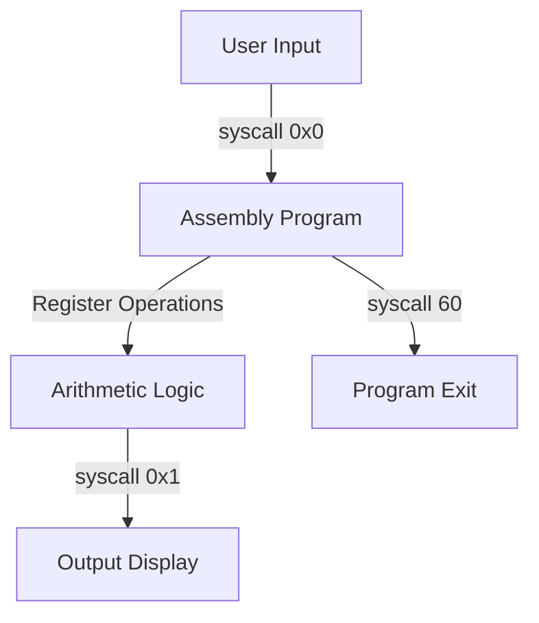

# 🧮 Simple x86 Assembly Calculator

<div align="center">


A sophisticated calculator implemented in x86 assembly language demonstrating low-level programming concepts and direct hardware interaction.

[Features](#features) •
[Installation](#installation) •
[Usage](#usage) •
[Development](#development) •
[Contributing](#contributing)

</div>

## 👨‍💻 Author

### Ethan Schoonbee
- GitHub: [Your GitHub Profile]
- LinkedIn: [Your LinkedIn Profile]

## 📝 Project Overview

This calculator is a command-line application that demonstrates the power and complexity of assembly language programming. It performs basic arithmetic operations while showcasing direct hardware interaction and low-level memory management.

### Core Operations
- ➕ Addition of single-digit numbers
- ➖ Subtraction of single-digit numbers
- ✖️ Multiplication of single-digit numbers
- ➗ Division of single-digit numbers

## 💻 Development Environment

### Hardware Specifications
- **CPU**: Intel 10th Gen Core i5-10xxxH
- **Architecture**: x86_64
- **Memory**: 16GB DDR4
- **OS**: Manjaro Linux (Rolling Release)

### Development Tools
<div align="center">

[](https://www.sublimetext.com/)
[](https://github.com/)
[](https://www.nasm.us/)

</div>

## 🛠️ Tech Stack & Architecture

### Core Technologies
- **NASM** (Netwide Assembler)
  - Version: 2.16.01
  - Purpose: x86_64 assembly compilation
- **x86_64 Assembly**
  - ISA: Intel 64-bit
  - Syntax: Intel syntax
- **Linux System Calls**
  - Kernel: 6.x
  - ABI: System V AMD64
- **ELF64 Format**
  - Type: Executable
  - Class: 64-bit

### System Interface


## 🌟 Key Features

### User Interface
- Interactive menu-driven operation
- Clear input prompts
- Formatted output display
- Graceful exit handling

### Technical Implementation
- Register-based computation (r8-r10)
- Stack memory management
- ASCII conversion handling
- Direct system call implementation

## 🔧 Technical Deep Dive

### Memory Management
```nasm
section .data
    ; Static data allocation
    welcome db "Hello and welcome..."
    
section .bss
    ; Dynamic memory reservation
    result resb 1
```

### Register Usage
- **r8**: First operand storage
- **r9**: Second operand storage
- **r10**: Result storage
- **rax**: System call numbers
- **rdi**: System call parameters
- **rsi**: Memory addressing

## 📥 Installation

### Prerequisites
- Manjaro Linux (or any Linux distribution)
- NASM Assembler
- GNU Linker (ld)

### Setup Steps
1. **Install NASM**
```bash
sudo pacman -S nasm    # For Manjaro
```

2. **Clone Repository**
```bash
git clone https://github.com/EthanSchoonbee/x86_assembly_simple_calculator/
cd x86_assembly_simple_calculator
```

3. **Build Process**
```bash
# Assemble source
nasm -f elf64 simple_calc.asm -o simple_calc.o

# Link object file
ld simple_calc.o -o simple_calc.a
```

## 🚀 Usage

### Running the Program
```bash
./simple_calc.a
```

### Operation Flow
1. Select operation (1-5)
2. Input first number (0-9)
3. Input second number (0-9)
4. View result
5. Repeat or exit

## 📚 Learning Resources

### Assembly Programming
- [x86 Assembly Guide](https://www.cs.virginia.edu/~evans/cs216/guides/x86.html)
- [NASM Documentation](https://www.nasm.us/docs.php)
- [Linux System Calls](https://blog.rchapman.org/posts/Linux_System_Call_Table_for_x86_64/)

### Computer Architecture
- [Intel® 64 Architecture Documentation](https://software.intel.com/content/www/us/en/develop/articles/intel-sdm.html)
- [System V AMD64 ABI](https://www.uclibc.org/docs/psABI-x86_64.pdf)

## 💡 Learning Outcomes

### Technical Skills Acquired
- Assembly language programming
- Low-level memory management
- System call implementation
- Register operations
- Stack manipulation
- ASCII/Binary conversion

### Computer Architecture Understanding
- Instruction set architecture
- Memory hierarchy
- CPU register usage
- I/O operations
- System calls

## ⚠️ Limitations & Future Improvements

### Current Limitations
- Single-digit operations only
- No floating-point support
- Limited error handling
- Positive numbers only
- No remainder in division

### Planned Improvements
- [ ] Multi-digit number support
- [ ] Floating-point operations
- [ ] Enhanced error handling
- [ ] Negative number support
- [ ] Memory operation optimization

## 📜 License

This project is licensed under the MIT License - see the [LICENSE](LICENSE) file for details.

---

<div align="center">

Made with ❤️ using Assembly

</div>
